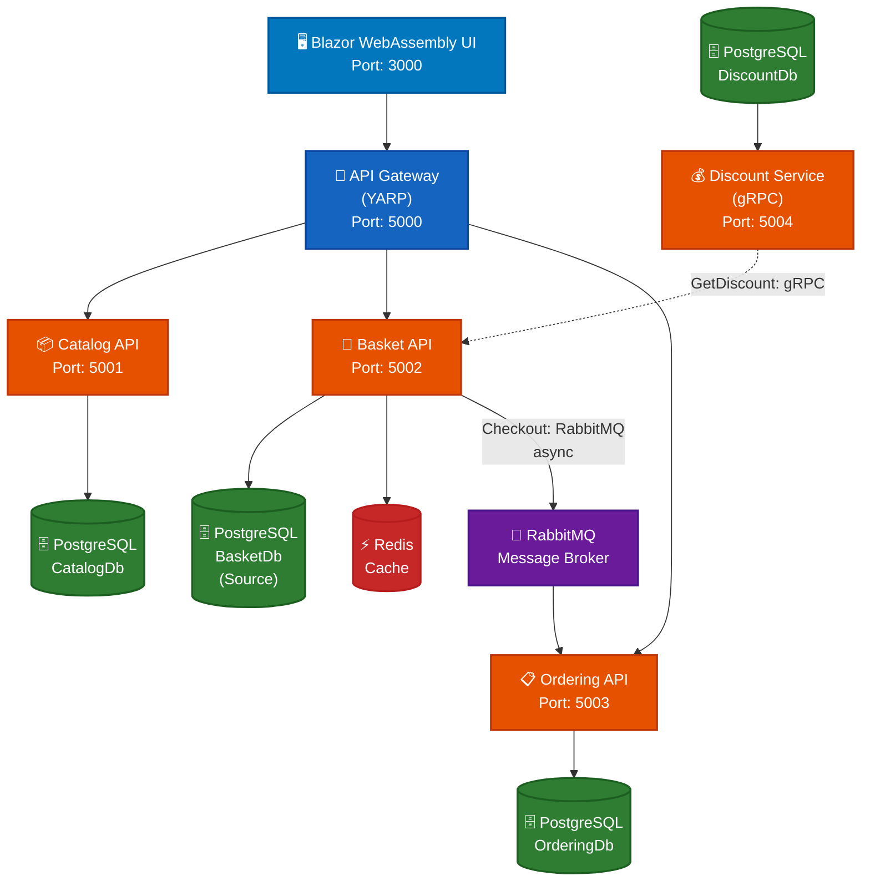

# 🏪 E-Shop Microservice Practice Project

> **Eğitim Amaçlı Microservice Mimarisi Projesi**  
> Bu proje, microservice mimarisi, Redis, RabbitMQ, gRPC, Docker ve diğer modern teknolojileri öğrenmek için tasarlanmış bir e-ticaret uygulamasıdır.

[](https://dotnet.microsoft.com/)
[](https://www.docker.com/)
[](https://www.postgresql.org/)
[](https://redis.io/)
[](https://www.rabbitmq.com/)

---

## 📋 İçindekiler

- [Proje Hakkında](#-proje-hakkında)
- [Öğrenilen Teknolojiler](#-öğrenilen-teknolojiler)
- [Mimari](#-mimari)
- [Servisler](#-servisler)
- [Teknoloji Stack](#-teknoloji-stack)
- [Kurulum](#-kurulum)
- [Kullanım](#-kullanım)
- [API Endpoints](#-api-endpoints)
- [Test](#-test)
- [Proje Yapısı](#-proje-yapısı)

---

## 🎯 Proje Hakkında

Bu proje, **microservice mimarisini öğrenmek** ve modern teknolojileri pratik yapmak için geliştirilmiş bir e-ticaret uygulamasıdır. Projenin temel amacı:

- ✅ **Microservice mimarisini** anlamak ve uygulamak
- ✅ **Redis** ile cache yönetimi ve performans optimizasyonu
- ✅ **RabbitMQ** ile asenkron mesajlaşma ve event-driven mimari
- ✅ **gRPC** ile yüksek performanslı servisler arası iletişim
- ✅ **Docker** ve **Docker Compose** ile containerization
- ✅ **CQRS** ve **MediatR** pattern'lerini öğrenmek
- ✅ **API Gateway** (YARP) ile merkezi yönetim
- ✅ **PostgreSQL** ile veritabanı yönetimi
- ✅ **Health Checks** ile servis izleme

### Proje Özellikleri

- 🏗️ **Microservice Mimarisi**: Her servis bağımsız çalışır
- 🖥️ **Blazor WebAssembly UI**: Modern web arayüzü
- 🔄 **CQRS Pattern**: Command ve Query ayrımı
- 📦 **Docker Compose**: Tek komutla tüm sistem
- 🚀 **API Gateway**: YARP ile merkezi routing
- 💾 **Cache-aside Pattern**: Redis ile performans optimizasyonu
- 📨 **Event-Driven**: RabbitMQ ile asenkron iletişim
- ⚡ **gRPC**: Yüksek performanslı senkron iletişim
- 💰 **İndirim Sistemi**: Ürün bazlı indirim yönetimi
- 🏥 **Health Checks**: Servis sağlık izleme

---

## 📚 Öğrenilen Teknolojiler

### Backend
- **ASP.NET Core 9.0** - Web API framework
- **CQRS + MediatR** - Command Query Responsibility Segregation pattern
- **FluentValidation** - Request validation
- **AutoMapper** - Object mapping
- **Entity Framework Core** - ORM
- **PostgreSQL** - Relational database

### Caching & Messaging
- **Redis** - In-memory cache (Cache-aside pattern)
- **RabbitMQ** - Message broker
- **MassTransit** - .NET message bus abstraction

### Communication
- **gRPC** - High-performance RPC framework
- **HTTP/2 Cleartext (h2c)** - gRPC over HTTP/2 without TLS
- **YARP** - Yet Another Reverse Proxy (API Gateway)

### Frontend
- **Blazor WebAssembly** - Client-side web UI framework
- **Bootstrap** - CSS framework for responsive design
- **JavaScript Interop** - Browser API integration

### Infrastructure
- **Docker** - Containerization
- **Docker Compose** - Multi-container orchestration
- **Health Checks** - Service monitoring

### Patterns & Practices
- **Microservice Architecture** - Service decomposition
- **CQRS** - Command Query Separation
- **Event-Driven Architecture** - Asynchronous messaging
- **Cache-aside Pattern** - Redis caching strategy
- **API Gateway Pattern** - Centralized entry point

---

## 🏗️ Mimari

### Sistem Mimarisi



### Servisler Arası İletişim

- **Synchronous (gRPC)**: Basket.API → Discount.Grpc (indirim sorgulama)
- **Asynchronous (RabbitMQ)**: Basket.API → Ordering.API (checkout event)

### Veritabanı Dağılımı

Her microservice kendi veritabanına sahiptir (Database per Service pattern):

- **Catalog.API** → PostgreSQL (CatalogDb)
- **Basket.API** → PostgreSQL (BasketDb) + **Redis (Cache)** - Cache-aside pattern
- **Ordering.API** → PostgreSQL (OrderingDb)
- **Discount.Grpc** → PostgreSQL (DiscountDb)

### Cache Stratejisi (Basket Service)

Basket Service **Cache-aside Pattern** kullanır:

```
Sepet Getirme:
1. Redis'te var mı? → Evet: Redis'ten döner
2. Redis'te yok mu? → PostgreSQL'den alır → Redis'e yazar → Döner

Sepet Kaydetme:
1. PostgreSQL'e yazar (source of truth)
2. Redis'e yazar (cache)
```

---

## 🔧 Servisler

### 1. Web UI (Blazor WebAssembly)

**Port:** 3000 (Docker), 5006 (Development)  
**Açıklama:** Kullanıcı arayüzü

**Özellikler:**
- Ürün listeleme ve detay görüntüleme
- Sepet yönetimi (ekleme, güncelleme, silme)
- Checkout (ödeme) işlemi
- Sipariş listeleme
- Responsive tasarım (Bootstrap)
- API Gateway üzerinden backend servislerle iletişim

### 2. Catalog Service (Ürün Kataloğu)

**Port:** 5001  
**Database:** PostgreSQL (CatalogDb)  
**Açıklama:** Ürün ve kategori yönetimi

**Özellikler:**
- Ürün listeleme, detay, arama
- Kategori yönetimi
- CRUD operasyonları
- Swagger UI desteği

### 3. Basket Service (Sepet)

**Port:** 5002  
**Database:** PostgreSQL (BasketDb) + Redis (Cache)  
**Açıklama:** Alışveriş sepeti yönetimi

**Özellikler:**
- Sepet oluşturma, güncelleme, silme
- Redis cache ile performans optimizasyonu
- gRPC ile indirim sorgulama
- İndirim hesaplama ve uygulama
- RabbitMQ ile checkout event gönderme
- Cache-aside pattern

### 4. Ordering Service (Sipariş)

**Port:** 5003  
**Database:** PostgreSQL (OrderingDb)  
**Açıklama:** Sipariş yönetimi

**Özellikler:**
- RabbitMQ event consumer
- Sipariş oluşturma (indirim bilgisi dahil)
- Sipariş sorgulama
- Kullanıcı bazlı sipariş listeleme
- MassTransit ile event handling

### 5. Discount Service (İndirim)

**Port:** 5004 (gRPC), 5005 (Health Check)  
**Database:** PostgreSQL (DiscountDb)  
**Açıklama:** İndirim kuponu yönetimi (gRPC servisi)

**Özellikler:**
- gRPC servisi (HTTP/2 cleartext)
- Ürün bazlı indirim sorgulama
- Kupon yönetimi (CRUD)
- Yüksek performanslı binary protokol

### 6. Gateway Service (API Gateway)

**Port:** 5000  
**Açıklama:** Merkezi API giriş noktası

**Özellikler:**
- YARP reverse proxy
- Request routing
- CORS desteği
- Health check aggregation
- Single entry point

---

## 🛠️ Teknoloji Stack

### Backend Framework
- **ASP.NET Core 9.0** - Web framework
- **C# 13** - Programming language

### Patterns & Libraries
- **MediatR** - CQRS implementation
- **FluentValidation** - Validation
- **AutoMapper** - Object mapping
- **Entity Framework Core** - ORM

### Databases
- **PostgreSQL 16** - Relational database
- **Redis Stack** - In-memory cache

### Messaging
- **RabbitMQ 3** - Message broker
- **MassTransit** - Message bus abstraction

### Communication
- **gRPC** - RPC framework
- **YARP** - Reverse proxy

### Infrastructure
- **Docker** - Containerization
- **Docker Compose** - Orchestration

### Tools
- **pgAdmin** - PostgreSQL management
- **RedisInsight** - Redis management
- **RabbitMQ Management UI** - RabbitMQ management

---

## 🚀 Kurulum

### Önkoşullar

- **.NET 9.0 SDK** veya üzeri
- **Docker** ve **Docker Compose** (v2.x)
- **Git**

### Adımlar

1. **Projeyi clone edin:**
```bash
git clone <repository-url>
cd microservice-practice-me
```

2. **Tüm servisleri başlatın:**
```bash
docker compose up -d
```

3. **Container'ların hazır olmasını bekleyin (30-40 saniye):**
```bash
docker compose ps
```

4. **Health check'leri test edin:**
```bash
curl http://localhost:5000/health  # Gateway
curl http://localhost:5001/health  # Catalog
curl http://localhost:5002/health  # Basket
curl http://localhost:5003/health  # Ordering
curl http://localhost:5005/health  # Discount
```

### Port Kullanımı

| Servis | Port | Açıklama |
|--------|------|----------|
| Web.UI | 3000 | Blazor WebAssembly UI (Docker) |
| Web.UI (Dev) | 5006 | Blazor WebAssembly UI (Development) |
| Gateway.API | 5000 | API Gateway |
| Catalog.API | 5001 | Ürün servisi |
| Basket.API | 5002 | Sepet servisi |
| Ordering.API | 5003 | Sipariş servisi |
| Discount.Grpc | 5004 | İndirim servisi (gRPC) |
| Discount Health | 5005 | İndirim health check |

### Management UI'lar

| Servis | URL | Kullanıcı/Şifre |
|--------|-----|-----------------|
| Web UI | http://localhost:3000 | - |
| RabbitMQ Management | http://localhost:15673 | guest / guest |
| RedisInsight | http://localhost:8001 | - |
| pgAdmin | http://localhost:5050 | admin@admin.com / admin |

---

## 💻 Kullanım

### Web UI (Önerilen)

Tüm işlemler web arayüzü üzerinden yapılabilir:

1. **Web UI'yi açın:**
   ```
   http://localhost:3000
   ```

2. **İşlemler:**
   - Ürünleri görüntüleme
   - Sepete ürün ekleme
   - Sepet yönetimi (adet güncelleme, silme)
   - Checkout (ödeme) işlemi
   - Sipariş geçmişi görüntüleme

### API Gateway Üzerinden Erişim (REST API)

Tüm API'lere Gateway üzerinden erişilir:

```bash
# Ürünleri listele
curl http://localhost:5000/catalog-service/api/products

# Sepet oluştur
curl -X POST http://localhost:5000/basket-service/api/baskets \
  -H "Content-Type: application/json" \
  -d '{
    "userName": "testuser",
    "items": [{
      "productId": "product-id",
      "productName": "iPhone 15",
      "quantity": 1,
      "price": 55000
    }]
  }'

# Sepeti getir (indirim otomatik uygulanmış)
curl http://localhost:5000/basket-service/api/baskets/testuser

# Checkout (sipariş oluştur)
curl -X POST http://localhost:5000/basket-service/api/baskets/checkout \
  -H "Content-Type: application/json" \
  -d '{
    "userName": "testuser",
    "firstName": "Test",
    "lastName": "User",
    "emailAddress": "test@example.com",
    "addressLine": "Test Address",
    "country": "Turkey",
    "state": "Istanbul",
    "zipCode": "34000",
    "cardName": "Test Card",
    "cardNumber": "1234567890123456",
    "expiration": "12/25",
    "cvv": "123",
    "paymentMethod": 1
  }'
```

### Swagger UI

Her servisin kendi Swagger UI'si vardır:

- **Catalog API**: http://localhost:5001/swagger
- **Basket API**: http://localhost:5002/swagger
- **Ordering API**: http://localhost:5003/swagger

---

## 📡 API Endpoints

### Catalog Service

```
GET    /api/products              # Ürünleri listele
GET    /api/products/{id}         # Ürün detayı
POST   /api/products              # Ürün ekle
PUT    /api/products/{id}         # Ürün güncelle
DELETE /api/products/{id}         # Ürün sil
GET    /api/categories             # Kategorileri listele
GET    /api/categories/{id}        # Kategori detayı
```

### Basket Service

```
GET    /api/baskets/{userName}     # Sepeti getir
POST   /api/baskets                # Sepet oluştur/güncelle
DELETE /api/baskets/{userName}     # Sepeti sil
POST   /api/baskets/checkout       # Checkout (sipariş oluştur)
```

### Ordering Service

```
GET    /api/orders                 # Siparişleri listele
GET    /api/orders/{id}            # Sipariş detayı
GET    /api/orders/user/{userName} # Kullanıcı siparişleri
```

### Discount Service (gRPC)

```
rpc GetDiscount(GetDiscountRequest) returns (CouponModel)
rpc CreateDiscount(CreateDiscountRequest) returns (CouponModel)
rpc UpdateDiscount(UpdateDiscountRequest) returns (CouponModel)
rpc DeleteDiscount(DeleteDiscountRequest) returns (DeleteDiscountResponse)
```

---

## 🧪 Test

### Health Check Testleri

```bash
# Tüm servislerin health check'lerini test et
curl http://localhost:5000/health
curl http://localhost:5001/health
curl http://localhost:5002/health
curl http://localhost:5003/health
curl http://localhost:5005/health
```

### End-to-End Test Senaryosu (Web UI)

1. **Web UI'yi açın:**
   ```
   http://localhost:3000
   ```

2. **Ürünleri görüntüleyin:**
   - Ana sayfada ürün listesi görüntülenir

3. **Sepete ürün ekleyin:**
   - Ürün kartında "Sepete Ekle" butonuna tıklayın
   - İndirim otomatik olarak uygulanır

4. **Sepeti görüntüleyin:**
   - Sepet sayfasında toplam fiyat ve indirim görüntülenir
   - Ürün adetini güncelleyebilir veya silebilirsiniz

5. **Checkout yapın:**
   - "Ödemeye Geç" butonuna tıklayın
   - Ödeme bilgilerini girin
   - Siparişi tamamlayın

6. **Siparişleri görüntüleyin:**
   - "Siparişlerim" sayfasından sipariş geçmişinizi görüntüleyebilirsiniz

### End-to-End Test Senaryosu (REST API)

1. **Ürün listesini al:**
```bash
curl http://localhost:5000/catalog-service/api/products
```

2. **Sepete ürün ekle:**
```bash
curl -X POST http://localhost:5000/basket-service/api/baskets \
  -H "Content-Type: application/json" \
  -d '{
    "userName": "testuser",
    "items": [{
      "productId": "macbook-id",
      "productName": "MacBook Pro",
      "quantity": 1,
      "price": 55000
    }]
  }'
```

3. **Sepeti getir (indirim otomatik uygulanmış olmalı):**
```bash
curl http://localhost:5000/basket-service/api/baskets/testuser
```

4. **Checkout yap (sipariş oluştur):**
```bash
curl -X POST http://localhost:5000/basket-service/api/baskets/checkout \
  -H "Content-Type: application/json" \
  -d '{...checkout data...}'
```

5. **Siparişi kontrol et:**
```bash
curl http://localhost:5000/ordering-service/api/orders/user/testuser
```

---

## 📁 Proje Yapısı

```
microservice-practice-me/
│
├── src/
│   ├── Services/
│   │   ├── Catalog/
│   │   │   └── Catalog.API/
│   │   ├── Basket/
│   │   │   └── Basket.API/
│   │   ├── Ordering/
│   │   │   └── Ordering.API/
│   │   └── Discount/
│   │       └── Discount.Grpc/
│   │
│   ├── Clients/
│   │   └── Web.UI/                # Blazor WebAssembly UI
│   │
│   ├── ApiGateway/
│   │   └── Gateway.API/
│   │
│   └── BuildingBlocks/
│       ├── BuildingBlocks.Exceptions/
│       ├── BuildingBlocks.Behaviors/
│       └── BuildingBlocks.Messaging/
│
├── docs/                          # Dokümantasyon
├── docker-compose.yml             # Docker Compose konfigürasyonu
├── global.json                    # .NET SDK versiyonu
├── Directory.Build.props           # Ortak build ayarları
├── Directory.Packages.props       # Central Package Management
└── README.md                      # Bu dosya
```

---

## 🛑 Durdurma

### Tüm servisleri durdurma

```bash
docker compose down
```

### Volume'ları da silmek için (veritabanı verileri silinir)

```bash
docker compose down -v
```

---

## 📖 Dokümantasyon

Detaylı dokümantasyon için `docs/` klasörüne bakın:

- **Mimari Dokümantasyon**: `docs/architecture/`
- **Kurulum Rehberi**: `docs/proje-calisma-kilavuzu.md`
- **Veritabanı Özeti**: `docs/docker-databases-summary.md`

---

## 🤝 Katkıda Bulunma

Bu proje eğitim amaçlıdır. Öneriler ve iyileştirmeler için issue açabilirsiniz.

---

## 📝 Lisans

Bu proje eğitim amaçlıdır ve açık kaynak kodludur.

---

## 🙏 Teşekkürler

Bu proje, microservice mimarisi ve modern teknolojileri öğrenmek için hazırlanmıştır. Projede kullanılan teknolojiler:

- [ASP.NET Core](https://dotnet.microsoft.com/)
- [Docker](https://www.docker.com/)
- [PostgreSQL](https://www.postgresql.org/)
- [Redis](https://redis.io/)
- [RabbitMQ](https://www.rabbitmq.com/)
- [gRPC](https://grpc.io/)
- [YARP](https://microsoft.github.io/reverse-proxy/)

---

**⭐ Bu projeyi beğendiyseniz yıldız vermeyi unutmayın!**
