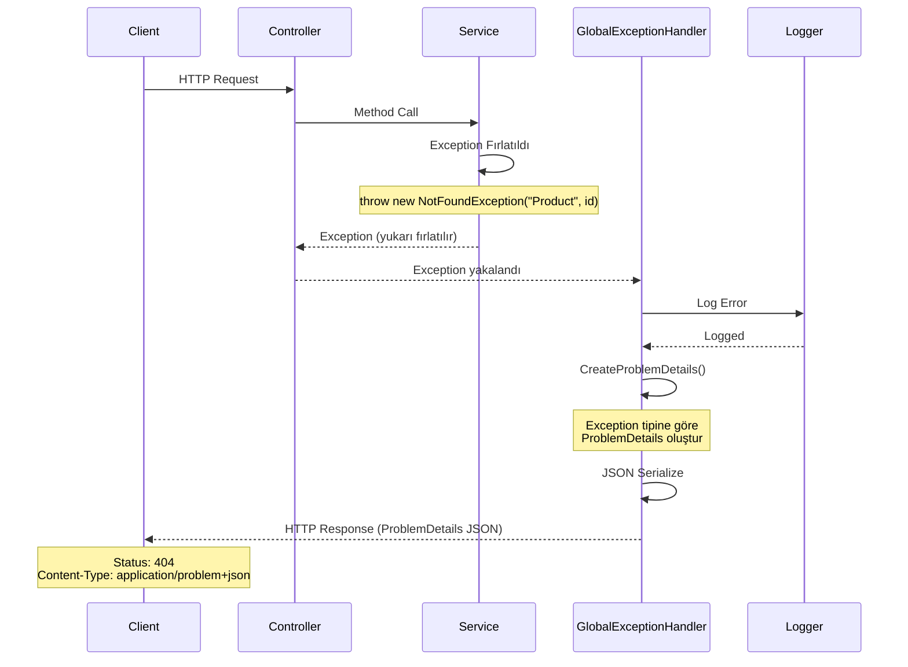
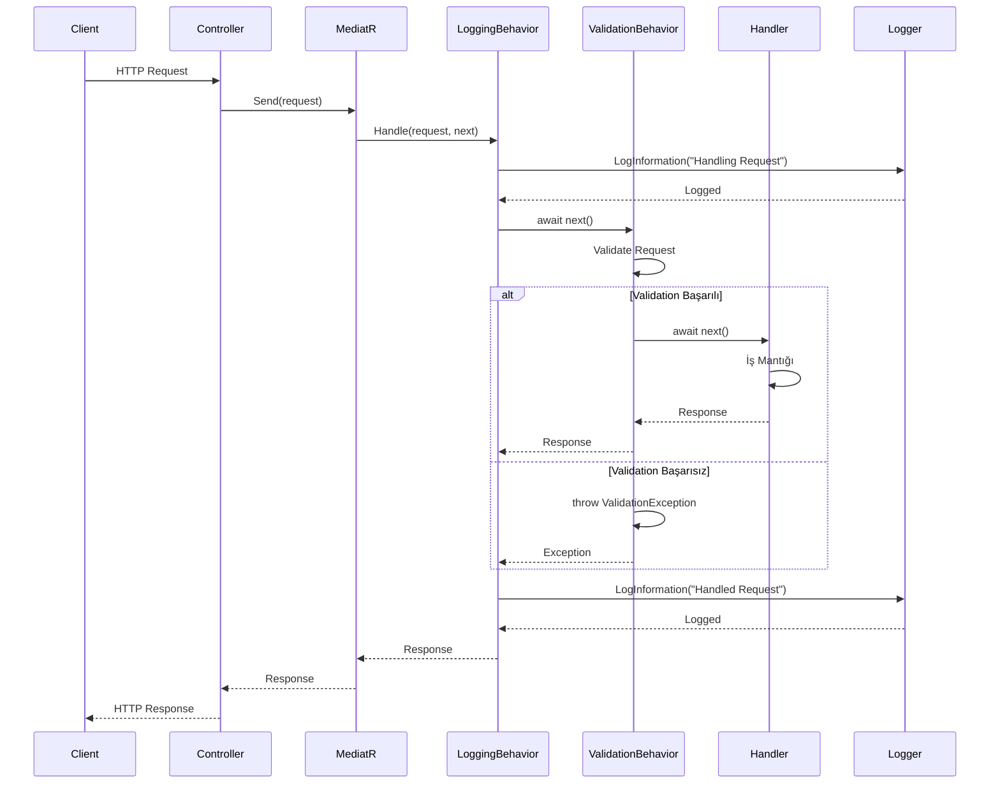
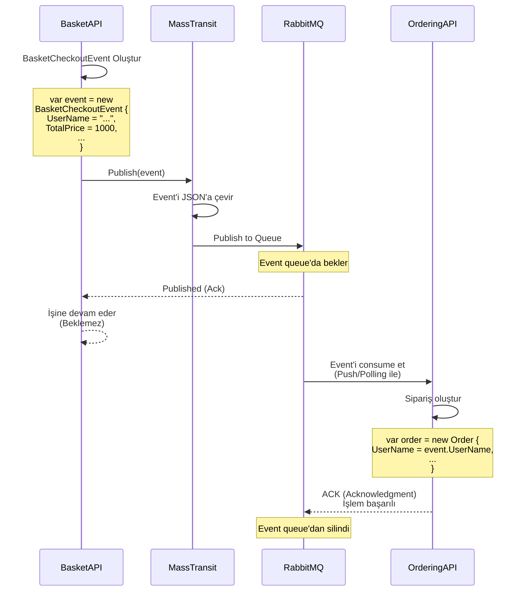
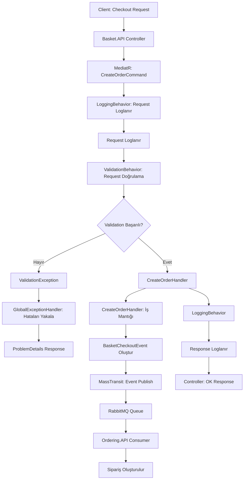

# Faz 2 - BuildingBlocks Akış Dokümantasyonu

> Bu dokümantasyon, Faz 2'de oluşturulan BuildingBlocks'ların ne işe yaradığını, neden var olduğunu, hangi teknolojilerin kullanıldığını ve nasıl çalıştığını akış diagramlarıyla açıklar.

---

## 📋 İçindekiler

1. [Genel Bakış](#genel-bakış)
2. [BuildingBlocks.Exceptions](#buildingblocksexceptions)
3. [BuildingBlocks.Behaviors](#buildingblocksbehaviors)
4. [BuildingBlocks.Messaging](#buildingblocksmessaging)
5. [Genel Akış (Tüm BuildingBlocks Birlikte)](#genel-akış-tüm-buildingblocks-birlikte)

---

## Genel Bakış

**BuildingBlocks**, tüm microservice'lerde ortak kullanılacak kod parçalarını içeren class library projeleridir.

### Neden Var?

**Problem:**
- Her microservice'de aynı kodları tekrar yazmak (kod tekrarı)
- Farklı servislerde farklı hata yönetimi (tutarsızlık)
- Validation ve logging kodlarını her yerde yazmak (bakım zorluğu)
- Microservice'ler arası mesajlaşma için standart yapı eksikliği

**Çözüm:**
- Merkezi exception handling (BuildingBlocks.Exceptions)
- Merkezi validation ve logging (BuildingBlocks.Behaviors)
- Standart mesajlaşma yapısı (BuildingBlocks.Messaging)

### Faydaları

- ✅ **Kod Tekrarı Önlenir:** Ortak kodlar tek yerde
- ✅ **Tutarlılık Sağlanır:** Tüm servislerde aynı yapı
- ✅ **Merkezi Yönetim:** Tek yerden güncelleme
- ✅ **Bakım Kolaylaşır:** Değişiklik tek yerde yapılır

---

## BuildingBlocks.Exceptions

### Ne İşe Yarar?

**BuildingBlocks.Exceptions**, tüm microservice'lerde ortak kullanılacak exception handling (hata yönetimi) yapısını sağlar.

**Görevleri:**
1. Custom exception class'ları (NotFoundException, BadRequestException, InternalServerException)
2. Global exception handler (GlobalExceptionHandler)
3. Standart hata formatı (ProblemDetails - RFC 7807)

### Neden Var?

**Problem:**
- Her serviste farklı hata yönetimi
- Tutarsız hata mesajları
- Stack trace'in kullanıcıya gösterilmesi (güvenlik riski)
- Her controller'da try-catch yazmak (kod tekrarı)

**Çözüm:**
- Merkezi exception handling
- Standart ProblemDetails formatı
- Güvenli hata mesajları (stack trace gösterilmez)
- Controller'larda try-catch gereksiz

### Hangi Teknolojiler?

| Teknoloji | Versiyon | Ne İşe Yarar |
|-----------|----------|--------------|
| **Microsoft.AspNetCore.App** | Framework Reference | IExceptionHandler, ProblemDetails, HttpContext |
| **System.Text.Json** | .NET 9.0 Built-in | ProblemDetails'i JSON'a çevirmek |
| **Microsoft.Extensions.Logging** | Framework Reference | Exception'ları loglamak |

### Input / Output

**Input:**
- Exception fırlatıldı (Controller, Service, Handler'dan)
- Exception tipi: `NotFoundException`, `BadRequestException`, `InternalServerException` veya genel `Exception`

**Output:**
- HTTP Response (JSON formatında)
- Content-Type: `application/problem+json`
- Status Code: Exception tipine göre (404, 400, 500)
- Body: ProblemDetails JSON

### Exception'ların İlişkisi ve Amacı

**Önemli Not:** `Exceptions/` klasöründeki custom exception'lar (`NotFoundException`, `BadRequestException`, `InternalServerException`) **tam olarak** `GlobalExceptionHandler` tarafından yakalanabilmek için tasarlanmıştır.

#### Nasıl Çalışır?

```
┌─────────────────────────────────────┐
│ Exceptions Klasörü                  │
│ - NotFoundException                 │
│ - BadRequestException               │
│ - InternalServerException           │
└──────────────┬──────────────────────┘
               │
               │ Bu exception'lar FİRLATILIR
               │ throw new NotFoundException(...)
               ↓
┌─────────────────────────────────────┐
│ GlobalExceptionHandler              │
│ - Bu exception'ları YAKALAR         │
│ - HTTP status code'a ÇEVİRİR        │
│   NotFoundException → 404           │
│   BadRequestException → 400         │
│   InternalServerException → 500     │
└─────────────────────────────────────┘
```

#### Neden Bu Yapı?

- **Standart Exception:** Her zaman 500 Internal Server Error döner (tutarsızlık)
- **Custom Exception + GlobalExceptionHandler:** Doğru HTTP status code döner (tutarlılık)

#### Örnek:

**Kod:**
```csharp
// Servis/Controller'da
throw new NotFoundException("Product", id);
```

**GlobalExceptionHandler Yakalar:**
```csharp
NotFoundException notFound => new ProblemDetails
{
    Status = 404,  // HTTP 404'e çevirir
    Detail = notFound.Message  // Exception mesajını kullanır
}
```

**Sonuç:** HTTP 404 Not Found response

**Özet:** Custom exception'lar, GlobalExceptionHandler tarafından yakalanıp doğru HTTP status code'una dönüştürülmek için vardır. Bu sayede servislerde standart exception kullanmak yerine, anlamlı exception'lar fırlatılır ve otomatik olarak doğru HTTP yanıtına çevrilir.

### Akış Diagramı



### Detaylı Akış

```
1. Exception Fırlatıldı
   ┌─────────────────────────────────┐
   │  Controller veya Service        │
   │  throw new NotFoundException(   │
   │    "Product", id                │
   │  );                             │
   └──────────────┬──────────────────┘
                  │
                  ↓
2. Exception Middleware Pipeline'a Gider
   ┌─────────────────────────────────┐
   │  ASP.NET Core Middleware         │
   │  UseExceptionHandler()           │
   └──────────────┬──────────────────┘
                  │
                  ↓
3. GlobalExceptionHandler Çağrılır
   ┌─────────────────────────────────┐
   │  GlobalExceptionHandler         │
   │  TryHandleAsync()                │
   └──────────────┬──────────────────┘
                  │
                  ├─→ Exception Loglanır
                  │   ILogger.LogError()
                  │
                  ├─→ ProblemDetails Oluşturulur
                  │   CreateProblemDetails()
                  │   - NotFoundException → 404
                  │   - BadRequestException → 400
                  │   - InternalServerException → 500
                  │   - Diğer → 500
                  │
                  └─→ JSON Serialize
                      System.Text.Json.Serialize()
                  
                  ↓
4. HTTP Response Döner
   ┌─────────────────────────────────┐
   │  HTTP Response                  │
   │  Status: 404                    │
   │  Content-Type: application/     │
   │    problem+json                 │
   │  Body: {                        │
   │    "type": "rfc7807",          │
   │    "title": "Not Found",       │
   │    "status": 404,              │
   │    "detail": "Entity...",       │
   │    "instance": "/api/..."      │
   │  }                              │
   └─────────────────────────────────┘
```

### GlobalExceptionHandler İç Akışı (Detaylı)

Exception yakalandıktan sonra `GlobalExceptionHandler.TryHandleAsync()` metodunda **adım adım** ne olduğu:

#### TryHandleAsync Metodu - Satır Satır Akış

```
1. Exception Yakalandı
   ┌─────────────────────────────────────────────┐
   │  TryHandleAsync() metodu çağrılır            │
   │  Parametreler:                              │
   │  - httpContext: HTTP isteğinin bilgileri    │
   │  - exception: Yakalanan exception nesnesi   │
   └──────────────┬──────────────────────────────┘
                  │
                  ↓
2. ILogger ile Exception Loglanır (Satır 24)
   ┌─────────────────────────────────────────────┐
   │  _logger.LogError(                           │
   │    exception,                                │
   │    "Exception occurred: {Message}",         │
   │    exception.Message                        │
   │  )                                          │
   └──────────────┬──────────────────────────────┘
                  │
                  ├─→ Ne Loglanır?
                  │   - Exception tipi (NotFoundException, vb.)
                  │   - Exception mesajı ("Entity 'Product' (123) was not found.")
                  │   - Stack trace (tam hata yolu - dosya, satır numarası)
                  │   - Inner exception varsa o da
                  │   - Timestamp (hata zamanı)
                  │
                  ├─→ Nerede Saklanır?
                  │   - Console'a yazılır (geliştirme ortamında)
                  │   - Dosyaya yazılır (Serilog gibi logger kullanılıyorsa)
                  │   - Veritabanına kaydedilir (production'da)
                  │   - Log aggregation tool'a gönderilir (ELK, Seq, vb.)
                  │
                  └─→ Neden Loglanır?
                      ✅ Hata analizi için (production'da debug için)
                      ✅ Monitoring/Alerting için (hata sayısını izlemek)
                      ✅ Audit trail için (ne zaman, hangi hatanın olduğu)
                      ✅ Stack trace kullanıcıya gösterilmez ama loglanır
                  
                  ↓
3. ProblemDetails Oluşturulur (Satır 26)
   ┌─────────────────────────────────────────────┐
   │  CreateProblemDetails(exception, httpContext)│
   └──────────────┬──────────────────────────────┘
                  │
                  ├─→ Exception tipine göre switch:
                  │
                  │   NotFoundException notFound
                  │   → Status: 404
                  │   → Title: "Not Found"
                  │   → Detail: notFound.Message
                  │
                  │   BadRequestException badRequest
                  │   → Status: 400
                  │   → Title: "Bad Request"
                  │   → Detail: badRequest.Message
                  │
                  │   InternalServerException internalServer
                  │   → Status: 500
                  │   → Title: "Internal Server Error"
                  │   → Detail: internalServer.Message
                  │
                  │   Diğer (catch-all: _)
                  │   → Status: 500
                  │   → Title: "An error occurred..."
                  │   → Detail: "An unexpected error occurred"
                  │
                  └─→ Instance: httpContext.Request.Path
                      (örn: "/api/products/123")
                  
                  ↓
4. HTTP Response Hazırlanır (Satır 28-29)
   ┌─────────────────────────────────────────────┐
   │  httpContext.Response.StatusCode = 404       │
   │  httpContext.Response.ContentType =          │
   │    "application/problem+json"                │
   └──────────────┬──────────────────────────────┘
                  │
                  ↓
5. ProblemDetails JSON'a Çevrilir (Satır 31)
   ┌─────────────────────────────────────────────┐
   │  JsonSerializer.Serialize(problemDetails)    │
   │  → JSON string oluşturulur                  │
   └──────────────┬──────────────────────────────┘
                  │
                  ↓
6. JSON Response'a Yazılır (Satır 32)
   ┌─────────────────────────────────────────────┐
   │  await httpContext.Response.WriteAsync(      │
   │    json,                                     │
   │    cancellationToken                        │
   │  )                                          │
   └──────────────┬──────────────────────────────┘
                  │
                  ↓
7. Response Client'a Döner
   HTTP 404 Not Found
   Content-Type: application/problem+json
   {
     "type": "https://tools.ietf.org/html/rfc7807",
     "title": "Not Found",
     "status": 404,
     "detail": "Entity \"Product\" (123) was not found.",
     "instance": "/api/products/123"
   }
```

#### ILogger Nedir ve Ne İşe Yarar?

**ILogger**, ASP.NET Core'un yerleşik logging (loglama) mekanizmasıdır.

**Ne İşe Yarar:**
- Uygulama olaylarını (event'leri) kaydetmek
- Hataları, bilgilendirmeleri, uyarıları loglamak
- Production'da uygulamanın durumunu izlemek

**GlobalExceptionHandler'da Kullanımı:**

```csharp
// Satır 24
_logger.LogError(exception, "Exception occurred: {Message}", exception.Message);
```

**Bu kod ne yapar?**
1. `LogError()`: Log seviyesi "Error" olarak işaretlenir (kritik hata)
2. `exception`: Exception nesnesinin kendisi loglanır (stack trace dahil)
3. `"Exception occurred: {Message}"`: Log mesajı (şablon)
4. `exception.Message`: Mesaj parametresi (örn: "Entity 'Product' (123) was not found.")

**Log Çıktısı Örneği:**

```
[2024-12-20 10:30:45] [Error] Exception occurred: Entity "Product" (123) was not found.
System.Exception: Entity "Product" (123) was not found.
   at BuildingBlocks.Exceptions.Exceptions.NotFoundException..ctor(String name, Object key)
   at Catalog.API.Services.ProductService.GetByIdAsync(Int32 id)
   at Catalog.API.Controllers.ProductController.GetProduct(Int32 id)
   at Microsoft.AspNetCore.Mvc.Infrastructure.ActionMethodExecutor...
```

**Neden Önemli?**
- ✅ **Stack Trace Kullanıcıya Gösterilmez:** Güvenlik (detaylı hata bilgisi gizlenir)
- ✅ **Ama Loglanır:** Developer/Debug için gerekli bilgi saklanır
- ✅ **Production Monitoring:** Hangi hataların ne sıklıkta olduğu izlenir
- ✅ **Error Tracking:** Hata analizi ve düzeltme için kritik

#### Özet: Logger vs Kullanıcıya Gösterilen

| Bilgi | Kullanıcıya Gösterilir mi? | Logger'a Yazılır mı? |
|-------|---------------------------|---------------------|
| Exception Tipi | ✅ (Title: "Not Found") | ✅ |
| Exception Mesajı | ✅ (Detail: "Entity...") | ✅ |
| Stack Trace | ❌ (Güvenlik riski) | ✅ |
| Inner Exception | ❌ | ✅ |
| Request Path | ✅ (Instance: "/api/...") | ✅ |
| Timestamp | ❌ | ✅ |
| HTTP Status Code | ✅ (Status: 404) | ✅ (log context'inde) |

**Kritik Fark:**
- **Kullanıcıya:** Güvenli, anlaşılır hata mesajı (ProblemDetails)
- **Logger'a:** Tam detaylı hata bilgisi (debug için)

### Örnek Senaryo

**Input:**
```csharp
// ProductController.cs
[HttpGet("{id}")]
public async Task<IActionResult> GetProduct(int id)
{
    var product = await _productService.GetByIdAsync(id);
    if (product == null)
    {
        throw new NotFoundException("Product", id);
    }
    return Ok(product);
}
```

**Output:**
```json
{
  "type": "https://tools.ietf.org/html/rfc7807",
  "title": "Not Found",
  "status": 404,
  "detail": "Entity \"Product\" (123) was not found.",
  "instance": "/api/products/123"
}
```

---

## BuildingBlocks.Behaviors

### Ne İşe Yarar?

**BuildingBlocks.Behaviors**, MediatR pipeline'ında çalışan behavior'ları (ara katmanlar) sağlar.

**Görevleri:**
1. **ValidationBehavior:** Tüm MediatR request'lerini otomatik doğrular (FluentValidation ile)
2. **LoggingBehavior:** Tüm MediatR request/response'ları otomatik loglar

### Neden Var?

**Problem:**
- Her handler'da validation kodu yazmak (kod tekrarı)
- Her handler'da logging kodu yazmak (kod tekrarı)
- Validation hatalarının farklı formatlarda dönmesi (tutarsızlık)
- Logging formatının farklı olması (analiz zorluğu)

**Çözüm:**
- Merkezi validation (ValidationBehavior)
- Merkezi logging (LoggingBehavior)
- Pipeline pattern ile otomatik çalışır
- Handler'larda sadece iş mantığı yazılır

### Hangi Teknolojiler?

| Teknoloji | Versiyon | Ne İşe Yarar |
|-----------|----------|--------------|
| **MediatR** | 14.0.0 | Pipeline behavior pattern'i için |
| **FluentValidation** | 12.1.1 | Request validation kuralları |
| **FluentValidation.DependencyInjectionExtensions** | 12.1.1 | FluentValidation'ı DI container'a entegre eder |
| **Microsoft.Extensions.Logging** | Framework Reference | Request/Response logging |

### Input / Output

#### ValidationBehavior

**Input:**
- MediatR Request (IRequest<TResponse>)
- FluentValidation Validator'ları (DI container'dan)

**Output:**
- Validation başarılıysa: Handler'a devam eder (`await next()`)
- Validation başarısızsa: `ValidationException` fırlatılır (GlobalExceptionHandler yakalar)

#### LoggingBehavior

**Input:**
- MediatR Request (IRequest<TResponse>)
- ILogger instance

**Output:**
- Request loglanır (handler'dan önce)
- Response loglanır (handler'dan sonra)
- Handler'a devam eder (`await next()`)

### Akış Diagramı



### Detaylı Akış

#### ValidationBehavior Akışı

```
1. MediatR Request Geldi
   ┌─────────────────────────────────┐
   │  Controller                      │
   │  await _mediator.Send(request);  │
   └──────────────┬──────────────────┘
                  │
                  ↓
2. ValidationBehavior Çalışır
   ┌─────────────────────────────────┐
   │  ValidationBehavior             │
   │  Handle(request, next)          │
   └──────────────┬──────────────────┘
                  │
                  ├─→ DI Container'dan Validator'ları Al
                  │   IEnumerable<IValidator<TRequest>>
                  │
                  ├─→ FluentValidation ile Doğrula
                  │   validator.ValidateAsync(request)
                  │
                  ├─→ Hata Var mı?
                  │   ├─ Evet → ValidationException fırlat
                  │   │         (GlobalExceptionHandler yakalar)
                  │   │
                  │   └─ Hayır → Handler'a devam et
                  │              await next()
                  │
                  ↓
3. Handler Çalışır (Validation Başarılıysa)
   ┌─────────────────────────────────┐
   │  Handler                         │
   │  İş Mantığı                     │
   └─────────────────────────────────┘
```

#### LoggingBehavior Akışı

```
1. MediatR Request Geldi
   ┌─────────────────────────────────┐
   │  Controller                      │
   │  await _mediator.Send(request);  │
   └──────────────┬──────────────────┘
                  │
                  ↓
2. LoggingBehavior Çalışır (Handler'dan Önce)
   ┌─────────────────────────────────┐
   │  LoggingBehavior                 │
   │  Handle(request, next)           │
   └──────────────┬──────────────────┘
                  │
                  ├─→ Request Loglanır
                  │   ILogger.LogInformation(
                  │     "Handling {RequestName}: {@Request}",
                  │     requestName, request
                  │   )
                  │
                  └─→ Handler'a devam et
                      await next()
                  
                  ↓
3. Handler Çalışır
   ┌─────────────────────────────────┐
   │  Handler                         │
   │  İş Mantığı                     │
   └──────────────┬──────────────────┘
                  │
                  ↓
4. LoggingBehavior Çalışır (Handler'dan Sonra)
   ┌─────────────────────────────────┐
   │  LoggingBehavior                 │
   │  Response Loglanır              │
   │  ILogger.LogInformation(        │
   │    "Handled {RequestName}:      │
   │     {@Response}",               │
   │    requestName, response        │
   │  )                              │
   └─────────────────────────────────┘
```

### Pipeline Sırası

```
Request
  ↓
┌─────────────────────────┐
│ LoggingBehavior         │ ← Request loglanır
│ (Handler'dan önce)     │
└───────────┬─────────────┘
            ↓
┌─────────────────────────┐
│ ValidationBehavior      │ ← Request doğrulanır
│ (Handler'dan önce)     │
└───────────┬─────────────┘
            ↓
┌─────────────────────────┐
│ Handler                 │ ← İş mantığı
│ (İş Mantığı)           │
└───────────┬─────────────┘
            ↓
┌─────────────────────────┐
│ ValidationBehavior      │ ← Response geçer
│ (Handler'dan sonra)     │
└───────────┬─────────────┘
            ↓
┌─────────────────────────┐
│ LoggingBehavior         │ ← Response loglanır
│ (Handler'dan sonra)    │
└───────────┬─────────────┘
            ↓
Response
```

### Örnek Senaryo

**Input:**
```csharp
// CreateProductCommand.cs
public record CreateProductCommand(string Name, decimal Price) : IRequest<CreateProductResponse>;

// CreateProductCommandValidator.cs
public class CreateProductCommandValidator : AbstractValidator<CreateProductCommand>
{
    public CreateProductCommandValidator()
    {
        RuleFor(x => x.Name).NotEmpty();
        RuleFor(x => x.Price).GreaterThan(0);
    }
}

// ProductController.cs
[HttpPost]
public async Task<IActionResult> CreateProduct(CreateProductCommand command)
{
    var response = await _mediator.Send(command);
    return Ok(response);
}
```

**Akış:**
1. Controller → `_mediator.Send(command)`
2. LoggingBehavior → Request loglanır: `"Handling CreateProductCommand: {...}"`
3. ValidationBehavior → FluentValidation ile doğrulanır
   - Başarılı → Handler'a devam
   - Başarısız → ValidationException fırlatılır
4. Handler → İş mantığı çalışır
5. LoggingBehavior → Response loglanır: `"Handled CreateProductCommand: {...}"`
6. Controller → Response döner

---

## BuildingBlocks.Messaging

### Ne İşe Yarar?

**BuildingBlocks.Messaging**, microservice'ler arası asenkron mesajlaşma için integration event yapısını sağlar.

**Görevleri:**
1. Base integration event class (`IntegrationEvent`)
2. Spesifik event'ler (`BasketCheckoutEvent`)
3. MassTransit ile RabbitMQ entegrasyonu için yapı

### Neden Var?

**Problem:**
- Microservice'ler arası senkron iletişim (servisler birbirini bekler)
- Servisler arası sıkı bağımlılık (bir servis çökerse diğeri etkilenir)
- Scalability sorunları (servisler bağımsız scale edilemez)
- Standart event yapısı eksikliği

**Çözüm:**
- Asenkron mesajlaşma (RabbitMQ üzerinden)
- Servisler birbirini beklemez
- Loose coupling (gevşek bağlılık)
- Standart event yapısı (IntegrationEvent base class)

### Hangi Teknolojiler?

| Teknoloji | Versiyon | Ne İşe Yarar |
|-----------|----------|--------------|
| **MassTransit** | 8.5.7 | Message broker abstraction layer |
| **MassTransit.RabbitMQ** | 8.5.7 | RabbitMQ implementasyonu |
| **Record Type** | C# 9.0+ | Immutable event yapısı |

### Input / Output

**Input:**
- Integration Event instance (örn: `BasketCheckoutEvent`)
- Event property'leri (UserName, TotalPrice, Shipping Address, Payment Info, vb.)

**Output:**
- RabbitMQ'ya publish edilen event (JSON formatında)
- Event, RabbitMQ queue'da bekler
- Consumer servisler (Ordering.API) event'i consume eder

### Akış Diagramı



### Detaylı Akış

```
1. Event Oluşturulur
   ┌─────────────────────────────────┐
   │  Basket.API                      │
   │  var checkoutEvent = new         │
   │  BasketCheckoutEvent {           │
   │    UserName = "john_doe",        │
   │    TotalPrice = 1000,           │
   │    FirstName = "John",           │
   │    // ... diğer bilgiler        │
   │  }                               │
   └──────────────┬──────────────────┘
                  │
                  ↓
2. MassTransit ile Publish Edilir
   ┌─────────────────────────────────┐
   │  Basket.API                      │
   │  await _publishEndpoint          │
   │    .Publish(checkoutEvent);     │
   └──────────────┬──────────────────┘
                  │
                  ↓
3. MassTransit Event'i İşler
   ┌─────────────────────────────────┐
   │  MassTransit                    │
   │  - Event'i JSON'a çevir         │
   │  - RabbitMQ kurallarına göre    │
   │    hazırla                       │
   └──────────────┬──────────────────┘
                  │
                  ↓
4. RabbitMQ'ya Gönderilir
   ┌─────────────────────────────────┐
   │  RabbitMQ Container            │
   │  - Event queue'ya eklenir       │
   │  - Bekleyen consumer'lar için   │
   │    hazır                         │
   └──────────────┬──────────────────┘
                  │
                  ↓
5. RabbitMQ, Ordering.API'ye Event'i Gönderir
   ┌─────────────────────────────────┐
   │  RabbitMQ                        │
   │  - Queue'da event var            │
   │  - Ordering.API consumer olarak │
   │    bağlı (başlangıçta)          │
   │  - Event'i consumer'a gönderir  │
   │    (Push mekanizması veya        │
   │     Consumer polling yapar)      │
   └──────────────┬──────────────────┘
                  │
                  ↓
6. Ordering.API Event'i Consume Eder
   ┌─────────────────────────────────┐
   │  Ordering.API                   │
   │  BasketCheckoutConsumer         │
   │  Consume(context) {              │
   │    var event = context.Message; │
   │    // Sipariş oluştur           │
   │    // İşlem başarılı            │
   │  }                              │
   └──────────────┬──────────────────┘
                  │
                  ↓
7. Ordering.API, RabbitMQ'ya ACK Gönderir
   ┌─────────────────────────────────┐
   │  Ordering.API                   │
   │  → RabbitMQ'ya ACK gönderir     │
   │    (Acknowledgment)              │
   │  "Event'i başarıyla işledim"    │
   └──────────────┬──────────────────┘
                  │
                  ↓
8. RabbitMQ Event'i Queue'dan Siler
   ┌─────────────────────────────────┐
   │  RabbitMQ                        │
   │  - ACK aldı → Event'i siler     │
   │  - Queue'dan kalıcı olarak       │
   │    çıkarılır                     │
   └─────────────────────────────────┘
```

### RabbitMQ Consume Mekanizması (Detaylı)

#### RabbitMQ Event'i Ordering.API'ye Nasıl Bildiriyor?

RabbitMQ'da iki mekanizma var:

**1. Push (RabbitMQ → Consumer):**
- RabbitMQ, consumer'a (Ordering.API) otomatik olarak event gönderir
- MassTransit arka planda RabbitMQ ile connection kurar
- Queue'ya event geldiğinde, RabbitMQ consumer'ı uyarır
- Consumer hazırsa event'i alır

**2. Polling (Consumer → RabbitMQ):**
- Consumer (Ordering.API) periyodik olarak RabbitMQ'ya "yeni event var mı?" diye sorar
- MassTransit bu işlemi otomatik yapar

**Gerçekte:** MassTransit genellikle **Push mekanizması** kullanır (daha verimli)

#### ACK (Acknowledgment) Mekanizması Nedir?

**ACK (Acknowledgment)** = "Event'i başarıyla işledim" mesajı

**Nasıl Çalışır:**

```
1. RabbitMQ → Ordering.API: Event gönderir
   (Event hala queue'da, ama "Unacknowledged" durumunda)

2. Ordering.API: Event'i işler (sipariş oluşturur)
   
3. Ordering.API → RabbitMQ: ACK gönderir
   "Başarıyla işledim, event'i silebilirsin"

4. RabbitMQ: Event'i queue'dan siler
```

**ACK Gönderilmezse Ne Olur?**

- Eğer ACK gönderilmezse (timeout veya hata):
  - RabbitMQ event'i tekrar kuyruğa geri koyar
  - Başka bir consumer'a gönderir (retry)
  - Belirli sayıda denemeden sonra "Dead Letter Queue"ya gönderir

**MassTransit'te Otomatik:**
- MassTransit, consumer başarıyla çalışırsa otomatik ACK gönderir
- Exception fırlatılırsa ACK gönderilmez (RabbitMQ tekrar dener)

#### Tam Akış Özeti:

```
Basket.API
  ↓ Publish(event)
MassTransit
  ↓ JSON'a çevir
RabbitMQ Queue
  ↓ Event bekler (Ready durumunda)
  
RabbitMQ → Ordering.API: Event gönderir (Push)
  ↓ (Event Unacknowledged durumunda)
  
Ordering.API Consumer
  ↓ Event'i işler (sipariş oluşturur)
  ↓ Başarılı
  
Ordering.API → RabbitMQ: ACK gönderir
  ↓
RabbitMQ: Event'i queue'dan siler ✅
```

**Önemli Notlar:**

1. **Asenkron:** Basket.API, Ordering.API'nin işlemi bitirmesini beklemez
2. **Güvenilirlik:** ACK mekanizması sayesinde event kaybolmaz
3. **Retry:** ACK gönderilmezse event tekrar denenir
4. **Scalability:** Birden fazla Ordering.API instance'ı varsa, RabbitMQ event'i bunlardan birine gönderir (load balancing)

### Event Yapısı

```
IntegrationEvent (Base Class)
  ├─ Id: Guid (otomatik oluşturulur)
  ├─ CreatedAt: DateTime (otomatik oluşturulur)
  │
  └─ BasketCheckoutEvent (Inherit eder)
      ├─ UserName: string
      ├─ TotalPrice: decimal
      ├─ Shipping Address
      │   ├─ FirstName
      │   ├─ LastName
      │   ├─ EmailAddress
      │   ├─ AddressLine
      │   ├─ Country
      │   ├─ State
      │   └─ ZipCode
      └─ Payment Info
          ├─ CardName
          ├─ CardNumber
          ├─ Expiration
          ├─ CVV
          └─ PaymentMethod
```

### Örnek Senaryo

**Input:**
```csharp
// Basket.API - CheckoutController.cs
[HttpPost("checkout")]
public async Task<IActionResult> Checkout(BasketCheckoutDto dto)
{
    var checkoutEvent = new BasketCheckoutEvent
    {
        UserName = dto.UserName,
        TotalPrice = dto.TotalPrice,
        FirstName = dto.FirstName,
        // ... diğer bilgiler
    };
    
    await _publishEndpoint.Publish(checkoutEvent);
    
    return Ok(new { Message = "Checkout başarılı" });
}
```

**Akış:**
1. Basket.API → `BasketCheckoutEvent` oluşturulur
2. MassTransit → Event JSON'a çevrilir
3. RabbitMQ → Event queue'ya eklenir
4. Ordering.API → Event'i consume eder
5. Ordering.API → Sipariş oluşturulur

**Output:**
- RabbitMQ queue'da event bekler
- Ordering.API event'i alır ve işler
- Basket.API cevap beklemez, işine devam eder

---

## Genel Akış (Tüm BuildingBlocks Birlikte)

### Senaryo: Kullanıcı Sepeti Checkout Ediyor

Bu senaryoda tüm BuildingBlocks'ların birlikte nasıl çalıştığını göreceğiz.

### Akış Diagramı



### Detaylı Adım Adım Akış

#### 1. HTTP Request Geldi

```
Client
  ↓ HTTP POST /api/basket/checkout
Basket.API Controller
  ↓
[CreateOrderCommand oluşturulur]
  ↓
MediatR.Send(command)
```

#### 2. BuildingBlocks.Behaviors Devreye Girer

```
MediatR Pipeline
  ↓
┌─────────────────────────────────┐
│ LoggingBehavior                 │
│ "Handling CreateOrderCommand"   │ ← Request loglanır
└───────────┬─────────────────────┘
            ↓
┌─────────────────────────────────┐
│ ValidationBehavior              │
│ FluentValidation ile doğrula    │
└───────────┬─────────────────────┘
            │
            ├─→ Validation Başarısız?
            │   └─→ ValidationException
            │       └─→ GlobalExceptionHandler
            │           └─→ ProblemDetails (400)
            │
            └─→ Validation Başarılı
                └─→ Handler'a devam
```

#### 3. Handler Çalışır

```
CreateOrderHandler
  ↓
[İş Mantığı]
  - Sepet bilgileri alınır
  - Fiyat hesaplanır
  - Event oluşturulur
  ↓
BasketCheckoutEvent
  - UserName
  - TotalPrice
  - Shipping Address
  - Payment Info
  ↓
MassTransit.Publish(event)
```

#### 4. BuildingBlocks.Messaging Devreye Girer

```
BasketCheckoutEvent
  ↓
MassTransit
  - Event JSON'a çevrilir
  - RabbitMQ kurallarına göre hazırlanır
  ↓
RabbitMQ Queue
  - Event queue'da bekler
  ↓
Ordering.API Consumer
  - Event'i consume eder
  - Sipariş oluşturulur
```

#### 5. Response Döner

```
Handler Response
  ↓
┌─────────────────────────────────┐
│ LoggingBehavior                 │
│ "Handled CreateOrderCommand"    │ ← Response loglanır
└───────────┬─────────────────────┘
            ↓
Controller
  ↓
HTTP 200 OK
  {
    "message": "Checkout başarılı"
  }
```

### Hata Senaryosu

Eğer validation başarısız olursa:

```
ValidationBehavior
  ↓ Validation Başarısız
ValidationException fırlatılır
  ↓
GlobalExceptionHandler yakalar
  ↓
ProblemDetails oluşturulur
  {
    "type": "rfc7807",
    "title": "Bad Request",
    "status": 400,
    "detail": "Validation failed: Name is required"
  }
  ↓
HTTP 400 Bad Request
```

### Teknoloji Stack

```
┌─────────────────────────────────────────┐
│ Client (Frontend/Mobile)                │
└─────────────────┬───────────────────────┘
                  │ HTTP
                  ↓
┌─────────────────────────────────────────┐
│ Basket.API (ASP.NET Core)               │
│                                         │
│  ┌───────────────────────────────────┐ │
│  │ BuildingBlocks.Behaviors         │ │
│  │ - ValidationBehavior              │ │
│  │ - LoggingBehavior                 │ │
│  └───────────────────────────────────┘ │
│                                         │
│  ┌───────────────────────────────────┐ │
│  │ MediatR                           │ │
│  │ - CQRS Pattern                    │ │
│  └───────────────────────────────────┘ │
│                                         │
│  ┌───────────────────────────────────┐ │
│  │ BuildingBlocks.Exceptions         │ │
│  │ - GlobalExceptionHandler          │ │
│  └───────────────────────────────────┘ │
│                                         │
│  ┌───────────────────────────────────┐ │
│  │ BuildingBlocks.Messaging          │ │
│  │ - IntegrationEvent                 │ │
│  │ - BasketCheckoutEvent             │ │
│  └───────────────────────────────────┘ │
│                                         │
│  ┌───────────────────────────────────┐ │
│  │ MassTransit                       │ │
│  │ - Publish/Consume                 │ │
│  └───────────────────────────────────┘ │
└─────────────────┬───────────────────────┘
                  │ RabbitMQ
                  ↓
┌─────────────────────────────────────────┐
│ RabbitMQ Container                     │
│ - Message Broker                       │
│ - Queue Management                     │
└─────────────────┬───────────────────────┘
                  │ Consume
                  ↓
┌─────────────────────────────────────────┐
│ Ordering.API (ASP.NET Core)           │
│                                         │
│  ┌───────────────────────────────────┐ │
│  │ MassTransit Consumer              │ │
│  │ - BasketCheckoutConsumer          │ │
│  └───────────────────────────────────┘ │
│                                         │
│  ┌───────────────────────────────────┐ │
│  │ Order Service                      │ │
│  │ - Sipariş oluştur                  │ │
│  └───────────────────────────────────┘ │
└─────────────────────────────────────────┘
```

### Özet Tablo

| BuildingBlock | Input | Output | Teknoloji | Ne Zaman Çalışır? |
|--------------|-------|--------|-----------|-------------------|
| **Exceptions** | Exception | ProblemDetails JSON | IExceptionHandler, ProblemDetails | Exception fırlatıldığında |
| **Behaviors (Validation)** | MediatR Request | Validated Request veya ValidationException | MediatR, FluentValidation | Her MediatR request'inde |
| **Behaviors (Logging)** | MediatR Request/Response | Logged Request/Response | MediatR, ILogger | Her MediatR request/response'unda |
| **Messaging** | IntegrationEvent | RabbitMQ'ya publish edilen event | MassTransit, RabbitMQ | Event publish edildiğinde |

### Faydaları (Birlikte)

1. **Tutarlılık:** Tüm servislerde aynı exception handling, validation, logging
2. **Güvenlik:** Stack trace gösterilmez, güvenli hata mesajları
3. **Bakım Kolaylığı:** Tek yerden güncelleme
4. **Scalability:** Asenkron mesajlaşma ile servisler bağımsız scale edilebilir
5. **Monitoring:** Tüm request/response'lar loglanır, kolay analiz
6. **Test Edilebilirlik:** Her component ayrı test edilebilir

---

## Sonuç

Faz 2'de oluşturulan BuildingBlocks'lar, microservice mimarisinde:

- ✅ **Merkezi yönetim** sağlar
- ✅ **Kod tekrarını** önler
- ✅ **Tutarlılık** sağlar
- ✅ **Bakımı** kolaylaştırır
- ✅ **Scalability** sağlar
- ✅ **Güvenlik** sağlar

Tüm BuildingBlocks'lar birlikte çalışarak, microservice'lerin daha güvenli, tutarlı ve ölçeklenebilir olmasını sağlar.

---

**Son Güncelleme:** Aralık 2024

