```mermaid
sequenceDiagram
    participant Client
    participant Controller
    participant Service
    participant GlobalExceptionHandler
    participant Logger

    Client->>Controller: HTTP Request
    Controller->>Service: Method Call
    Service->>Service: Exception Fırlatıldı
    Note over Service: throw new NotFoundException("Product", id)
    
    Service-->>Controller: Exception (yukarı fırlatılır)
    Controller-->>GlobalExceptionHandler: Exception yakalandı
    
    GlobalExceptionHandler->>Logger: Log Error
    Logger-->>GlobalExceptionHandler: Logged
    
    GlobalExceptionHandler->>GlobalExceptionHandler: CreateProblemDetails()
    Note over GlobalExceptionHandler: Exception tipine göre<br/>ProblemDetails oluştur
    
    GlobalExceptionHandler->>GlobalExceptionHandler: JSON Serialize
    GlobalExceptionHandler-->>Client: HTTP Response (ProblemDetails JSON)
    Note over Client: Status: 404<br/>Content-Type: application/problem+json
```

```mermaid
sequenceDiagram
    participant Client
    participant Controller
    participant MediatR
    participant LoggingBehavior
    participant ValidationBehavior
    participant Handler
    participant Logger

    Client->>Controller: HTTP Request
    Controller->>MediatR: Send(request)
    
    MediatR->>LoggingBehavior: Handle(request, next)
    LoggingBehavior->>Logger: LogInformation("Handling Request")
    Logger-->>LoggingBehavior: Logged
    
    LoggingBehavior->>ValidationBehavior: await next()
    
    ValidationBehavior->>ValidationBehavior: Validate Request
    alt Validation Başarılı
        ValidationBehavior->>Handler: await next()
        Handler->>Handler: İş Mantığı
        Handler-->>ValidationBehavior: Response
        ValidationBehavior-->>LoggingBehavior: Response
    else Validation Başarısız
        ValidationBehavior->>ValidationBehavior: throw ValidationException
        ValidationBehavior-->>LoggingBehavior: Exception
    end
    
    LoggingBehavior->>Logger: LogInformation("Handled Request")
    Logger-->>LoggingBehavior: Logged
    LoggingBehavior-->>MediatR: Response
    MediatR-->>Controller: Response
    Controller-->>Client: HTTP Response
```

```mermaid
sequenceDiagram
    participant BasketAPI
    participant MassTransit
    participant RabbitMQ
    participant OrderingAPI

    BasketAPI->>BasketAPI: BasketCheckoutEvent Oluştur
    Note over BasketAPI: var event = new<br/>BasketCheckoutEvent {<br/>  UserName = "...",<br/>  TotalPrice = 1000,<br/>  ...<br/>}
    
    BasketAPI->>MassTransit: Publish(event)
    MassTransit->>MassTransit: Event'i JSON'a çevir
    MassTransit->>RabbitMQ: Publish to Queue
    Note over RabbitMQ: Event queue'da bekler
    
    RabbitMQ-->>BasketAPI: Published (Ack)
    BasketAPI-->>BasketAPI: İşine devam eder<br/>(Beklemez)
    
    RabbitMQ->>OrderingAPI: Event'i consume et
    OrderingAPI->>OrderingAPI: Sipariş oluştur
    Note over OrderingAPI: var order = new Order {<br/>  UserName = event.UserName,<br/>  ...<br/>}
```

# Faz 2 - BuildingBlocks Akış Dokümantasyonu

> Bu dokümantasyon, Faz 2'de oluşturulan BuildingBlocks'ların ne işe yaradığını, neden var olduğunu, hangi teknolojilerin kullanıldığını ve nasıl çalıştığını akış diagramlarıyla açıklar.

---

## 📋 İçindekiler

1. [Genel Bakış](#genel-bakış)
2. [BuildingBlocks.Exceptions](#buildingblocksexceptions)
3. [BuildingBlocks.Behaviors](#buildingblocksbehaviors)
4. [BuildingBlocks.Messaging](#buildingblocksmessaging)
5. [Genel Akış (Tüm BuildingBlocks Birlikte)](#genel-akış-tüm-buildingblocks-birlikte)

---

## Genel Bakış

**BuildingBlocks**, tüm microservice'lerde ortak kullanılacak kod parçalarını içeren class library projeleridir.

### Neden Var?

**Problem:**
- Her microservice'de aynı kodları tekrar yazmak (kod tekrarı)
- Farklı servislerde farklı hata yönetimi (tutarsızlık)
- Validation ve logging kodlarını her yerde yazmak (bakım zorluğu)
- Microservice'ler arası mesajlaşma için standart yapı eksikliği

**Çözüm:**
- Merkezi exception handling (BuildingBlocks.Exceptions)
- Merkezi validation ve logging (BuildingBlocks.Behaviors)
- Standart mesajlaşma yapısı (BuildingBlocks.Messaging)

### Faydaları

- ✅ **Kod Tekrarı Önlenir:** Ortak kodlar tek yerde
- ✅ **Tutarlılık Sağlanır:** Tüm servislerde aynı yapı
- ✅ **Merkezi Yönetim:** Tek yerden güncelleme
- ✅ **Bakım Kolaylaşır:** Değişiklik tek yerde yapılır

---

## BuildingBlocks.Exceptions

### Ne İşe Yarar?

**BuildingBlocks.Exceptions**, tüm microservice'lerde ortak kullanılacak exception handling (hata yönetimi) yapısını sağlar.

**Görevleri:**
1. Custom exception class'ları (NotFoundException, BadRequestException, InternalServerException)
2. Global exception handler (GlobalExceptionHandler)
3. Standart hata formatı (ProblemDetails - RFC 7807)

### Neden Var?

**Problem:**
- Her serviste farklı hata yönetimi
- Tutarsız hata mesajları
- Stack trace'in kullanıcıya gösterilmesi (güvenlik riski)
- Her controller'da try-catch yazmak (kod tekrarı)

**Çözüm:**
- Merkezi exception handling
- Standart ProblemDetails formatı
- Güvenli hata mesajları (stack trace gösterilmez)
- Controller'larda try-catch gereksiz

### Hangi Teknolojiler?

| Teknoloji | Versiyon | Ne İşe Yarar |
|-----------|----------|--------------|
| **Microsoft.AspNetCore.App** | Framework Reference | IExceptionHandler, ProblemDetails, HttpContext |
| **System.Text.Json** | .NET 9.0 Built-in | ProblemDetails'i JSON'a çevirmek |
| **Microsoft.Extensions.Logging** | Framework Reference | Exception'ları loglamak |

### Input / Output

**Input:**
- Exception fırlatıldı (Controller, Service, Handler'dan)
- Exception tipi: `NotFoundException`, `BadRequestException`, `InternalServerException` veya genel `Exception`

**Output:**
- HTTP Response (JSON formatında)
- Content-Type: `application/problem+json`
- Status Code: Exception tipine göre (404, 400, 500)
- Body: ProblemDetails JSON

### Akış Diagramı



### Detaylı Akış

```
1. Exception Fırlatıldı
   ┌─────────────────────────────────┐
   │  Controller veya Service        │
   │  throw new NotFoundException(   │
   │    "Product", id                │
   │  );                             │
   └──────────────┬──────────────────┘
                  │
                  ↓
2. Exception Middleware Pipeline'a Gider
   ┌─────────────────────────────────┐
   │  ASP.NET Core Middleware         │
   │  UseExceptionHandler()           │
   └──────────────┬──────────────────┘
                  │
                  ↓
3. GlobalExceptionHandler Çağrılır
   ┌─────────────────────────────────┐
   │  GlobalExceptionHandler         │
   │  TryHandleAsync()                │
   └──────────────┬──────────────────┘
                  │
                  ├─→ Exception Loglanır
                  │   ILogger.LogError()
                  │
                  ├─→ ProblemDetails Oluşturulur
                  │   CreateProblemDetails()
                  │   - NotFoundException → 404
                  │   - BadRequestException → 400
                  │   - InternalServerException → 500
                  │   - Diğer → 500
                  │
                  └─→ JSON Serialize
                      System.Text.Json.Serialize()
                  
                  ↓
4. HTTP Response Döner
   ┌─────────────────────────────────┐
   │  HTTP Response                  │
   │  Status: 404                    │
   │  Content-Type: application/     │
   │    problem+json                 │
   │  Body: {                        │
   │    "type": "rfc7807",          │
   │    "title": "Not Found",       │
   │    "status": 404,              │
   │    "detail": "Entity...",       │
   │    "instance": "/api/..."      │
   │  }                              │
   └─────────────────────────────────┘
```

### Örnek Senaryo

**Input:**
```csharp
// ProductController.cs
[HttpGet("{id}")]
public async Task<IActionResult> GetProduct(int id)
{
    var product = await _productService.GetByIdAsync(id);
    if (product == null)
    {
        throw new NotFoundException("Product", id);
    }
    return Ok(product);
}
```

**Output:**
```json
{
  "type": "https://tools.ietf.org/html/rfc7807",
  "title": "Not Found",
  "status": 404,
  "detail": "Entity \"Product\" (123) was not found.",
  "instance": "/api/products/123"
}
```

---

## BuildingBlocks.Behaviors

### Ne İşe Yarar?

**BuildingBlocks.Behaviors**, MediatR pipeline'ında çalışan behavior'ları (ara katmanlar) sağlar.

**Görevleri:**
1. **ValidationBehavior:** Tüm MediatR request'lerini otomatik doğrular (FluentValidation ile)
2. **LoggingBehavior:** Tüm MediatR request/response'ları otomatik loglar

### Neden Var?

**Problem:**
- Her handler'da validation kodu yazmak (kod tekrarı)
- Her handler'da logging kodu yazmak (kod tekrarı)
- Validation hatalarının farklı formatlarda dönmesi (tutarsızlık)
- Logging formatının farklı olması (analiz zorluğu)

**Çözüm:**
- Merkezi validation (ValidationBehavior)
- Merkezi logging (LoggingBehavior)
- Pipeline pattern ile otomatik çalışır
- Handler'larda sadece iş mantığı yazılır

### Hangi Teknolojiler?

| Teknoloji | Versiyon | Ne İşe Yarar |
|-----------|----------|--------------|
| **MediatR** | 14.0.0 | Pipeline behavior pattern'i için |
| **FluentValidation** | 12.1.1 | Request validation kuralları |
| **FluentValidation.DependencyInjectionExtensions** | 12.1.1 | FluentValidation'ı DI container'a entegre eder |
| **Microsoft.Extensions.Logging** | Framework Reference | Request/Response logging |

### Input / Output

#### ValidationBehavior

**Input:**
- MediatR Request (IRequest<TResponse>)
- FluentValidation Validator'ları (DI container'dan)

**Output:**
- Validation başarılıysa: Handler'a devam eder (`await next()`)
- Validation başarısızsa: `ValidationException` fırlatılır (GlobalExceptionHandler yakalar)

#### LoggingBehavior

**Input:**
- MediatR Request (IRequest<TResponse>)
- ILogger instance

**Output:**
- Request loglanır (handler'dan önce)
- Response loglanır (handler'dan sonra)
- Handler'a devam eder (`await next()`)

### Akış Diagramı



### Detaylı Akış

#### ValidationBehavior Akışı

```
1. MediatR Request Geldi
   ┌─────────────────────────────────┐
   │  Controller                      │
   │  await _mediator.Send(request);  │
   └──────────────┬──────────────────┘
                  │
                  ↓
2. ValidationBehavior Çalışır
   ┌─────────────────────────────────┐
   │  ValidationBehavior             │
   │  Handle(request, next)          │
   └──────────────┬──────────────────┘
                  │
                  ├─→ DI Container'dan Validator'ları Al
                  │   IEnumerable<IValidator<TRequest>>
                  │
                  ├─→ FluentValidation ile Doğrula
                  │   validator.ValidateAsync(request)
                  │
                  ├─→ Hata Var mı?
                  │   ├─ Evet → ValidationException fırlat
                  │   │         (GlobalExceptionHandler yakalar)
                  │   │
                  │   └─ Hayır → Handler'a devam et
                  │              await next()
                  │
                  ↓
3. Handler Çalışır (Validation Başarılıysa)
   ┌─────────────────────────────────┐
   │  Handler                         │
   │  İş Mantığı                     │
   └─────────────────────────────────┘
```

#### LoggingBehavior Akışı

```
1. MediatR Request Geldi
   ┌─────────────────────────────────┐
   │  Controller                      │
   │  await _mediator.Send(request);  │
   └──────────────┬──────────────────┘
                  │
                  ↓
2. LoggingBehavior Çalışır (Handler'dan Önce)
   ┌─────────────────────────────────┐
   │  LoggingBehavior                 │
   │  Handle(request, next)           │
   └──────────────┬──────────────────┘
                  │
                  ├─→ Request Loglanır
                  │   ILogger.LogInformation(
                  │     "Handling {RequestName}: {@Request}",
                  │     requestName, request
                  │   )
                  │
                  └─→ Handler'a devam et
                      await next()
                  
                  ↓
3. Handler Çalışır
   ┌─────────────────────────────────┐
   │  Handler                         │
   │  İş Mantığı                     │
   └──────────────┬──────────────────┘
                  │
                  ↓
4. LoggingBehavior Çalışır (Handler'dan Sonra)
   ┌─────────────────────────────────┐
   │  LoggingBehavior                 │
   │  Response Loglanır              │
   │  ILogger.LogInformation(        │
   │    "Handled {RequestName}:      │
   │     {@Response}",               │
   │    requestName, response        │
   │  )                              │
   └─────────────────────────────────┘
```

### Pipeline Sırası

```
Request
  ↓
┌─────────────────────────┐
│ LoggingBehavior         │ ← Request loglanır
│ (Handler'dan önce)     │
└───────────┬─────────────┘
            ↓
┌─────────────────────────┐
│ ValidationBehavior      │ ← Request doğrulanır
│ (Handler'dan önce)     │
└───────────┬─────────────┘
            ↓
┌─────────────────────────┐
│ Handler                 │ ← İş mantığı
│ (İş Mantığı)           │
└───────────┬─────────────┘
            ↓
┌─────────────────────────┐
│ ValidationBehavior      │ ← Response geçer
│ (Handler'dan sonra)     │
└───────────┬─────────────┘
            ↓
┌─────────────────────────┐
│ LoggingBehavior         │ ← Response loglanır
│ (Handler'dan sonra)    │
└───────────┬─────────────┘
            ↓
Response
```

### Örnek Senaryo

**Input:**
```csharp
// CreateProductCommand.cs
public record CreateProductCommand(string Name, decimal Price) : IRequest<CreateProductResponse>;

// CreateProductCommandValidator.cs
public class CreateProductCommandValidator : AbstractValidator<CreateProductCommand>
{
    public CreateProductCommandValidator()
    {
        RuleFor(x => x.Name).NotEmpty();
        RuleFor(x => x.Price).GreaterThan(0);
    }
}

// ProductController.cs
[HttpPost]
public async Task<IActionResult> CreateProduct(CreateProductCommand command)
{
    var response = await _mediator.Send(command);
    return Ok(response);
}
```

**Akış:**
1. Controller → `_mediator.Send(command)`
2. LoggingBehavior → Request loglanır: `"Handling CreateProductCommand: {...}"`
3. ValidationBehavior → FluentValidation ile doğrulanır
   - Başarılı → Handler'a devam
   - Başarısız → ValidationException fırlatılır
4. Handler → İş mantığı çalışır
5. LoggingBehavior → Response loglanır: `"Handled CreateProductCommand: {...}"`
6. Controller → Response döner

---

## BuildingBlocks.Messaging

### Ne İşe Yarar?

**BuildingBlocks.Messaging**, microservice'ler arası asenkron mesajlaşma için integration event yapısını sağlar.

**Görevleri:**
1. Base integration event class (`IntegrationEvent`)
2. Spesifik event'ler (`BasketCheckoutEvent`)
3. MassTransit ile RabbitMQ entegrasyonu için yapı

### Neden Var?

**Problem:**
- Microservice'ler arası senkron iletişim (servisler birbirini bekler)
- Servisler arası sıkı bağımlılık (bir servis çökerse diğeri etkilenir)
- Scalability sorunları (servisler bağımsız scale edilemez)
- Standart event yapısı eksikliği

**Çözüm:**
- Asenkron mesajlaşma (RabbitMQ üzerinden)
- Servisler birbirini beklemez
- Loose coupling (gevşek bağlılık)
- Standart event yapısı (IntegrationEvent base class)

### Hangi Teknolojiler?

| Teknoloji | Versiyon | Ne İşe Yarar |
|-----------|----------|--------------|
| **MassTransit** | 8.5.7 | Message broker abstraction layer |
| **MassTransit.RabbitMQ** | 8.5.7 | RabbitMQ implementasyonu |
| **Record Type** | C# 9.0+ | Immutable event yapısı |

### Input / Output

**Input:**
- Integration Event instance (örn: `BasketCheckoutEvent`)
- Event property'leri (UserName, TotalPrice, Shipping Address, Payment Info, vb.)

**Output:**
- RabbitMQ'ya publish edilen event (JSON formatında)
- Event, RabbitMQ queue'da bekler
- Consumer servisler (Ordering.API) event'i consume eder

### Akış Diagramı



### Detaylı Akış

```
1. Event Oluşturulur
   ┌─────────────────────────────────┐
   │  Basket.API                      │
   │  var checkoutEvent = new         │
   │  BasketCheckoutEvent {           │
   │    UserName = "john_doe",        │
   │    TotalPrice = 1000,           │
   │    FirstName = "John",           │
   │    // ... diğer bilgiler        │
   │  }                               │
   └──────────────┬──────────────────┘
                  │
                  ↓
2. MassTransit ile Publish Edilir
   ┌─────────────────────────────────┐
   │  Basket.API                      │
   │  await _publishEndpoint          │
   │    .Publish(checkoutEvent);     │
   └──────────────┬──────────────────┘
                  │
                  ↓
3. MassTransit Event'i İşler
   ┌─────────────────────────────────┐
   │  MassTransit                    │
   │  - Event'i JSON'a çevir         │
   │  - RabbitMQ kurallarına göre    │
   │    hazırla                       │
   └──────────────┬──────────────────┘
                  │
                  ↓
4. RabbitMQ'ya Gönderilir
   ┌─────────────────────────────────┐
   │  RabbitMQ Container            │
   │  - Event queue'ya eklenir       │
   │  - Bekleyen consumer'lar için   │
   │    hazır                         │
   └──────────────┬──────────────────┘
                  │
                  ↓
5. Ordering.API Event'i Consume Eder
   ┌─────────────────────────────────┐
   │  Ordering.API                   │
   │  BasketCheckoutConsumer         │
   │  Consume(context) {              │
   │    var event = context.Message; │
   │    // Sipariş oluştur           │
   │  }                              │
   └─────────────────────────────────┘
```

### Event Yapısı

```
IntegrationEvent (Base Class)
  ├─ Id: Guid (otomatik oluşturulur)
  ├─ CreatedAt: DateTime (otomatik oluşturulur)
  │
  └─ BasketCheckoutEvent (Inherit eder)
      ├─ UserName: string
      ├─ TotalPrice: decimal
      ├─ Shipping Address
      │   ├─ FirstName
      │   ├─ LastName
      │   ├─ EmailAddress
      │   ├─ AddressLine
      │   ├─ Country
      │   ├─ State
      │   └─ ZipCode
      └─ Payment Info
          ├─ CardName
          ├─ CardNumber
          ├─ Expiration
          ├─ CVV
          └─ PaymentMethod
```

### Örnek Senaryo

**Input:**
```csharp
// Basket.API - CheckoutController.cs
[HttpPost("checkout")]
public async Task<IActionResult> Checkout(BasketCheckoutDto dto)
{
    var checkoutEvent = new BasketCheckoutEvent
    {
        UserName = dto.UserName,
        TotalPrice = dto.TotalPrice,
        FirstName = dto.FirstName,
        // ... diğer bilgiler
    };
    
    await _publishEndpoint.Publish(checkoutEvent);
    
    return Ok(new { Message = "Checkout başarılı" });
}
```

**Akış:**
1. Basket.API → `BasketCheckoutEvent` oluşturulur
2. MassTransit → Event JSON'a çevrilir
3. RabbitMQ → Event queue'ya eklenir
4. Ordering.API → Event'i consume eder
5. Ordering.API → Sipariş oluşturulur

**Output:**
- RabbitMQ queue'da event bekler
- Ordering.API event'i alır ve işler
- Basket.API cevap beklemez, işine devam eder

---

## Genel Akış (Tüm BuildingBlocks Birlikte)

### Senaryo: Kullanıcı Sepeti Checkout Ediyor

Bu senaryoda tüm BuildingBlocks'ların birlikte nasıl çalıştığını göreceğiz.

### Akış Diagramı



```mermaid
graph TD
    A[Client: Checkout Request] --> B[Basket.API Controller]
    B --> C[MediatR: CreateOrderCommand]
    
    C --> D[LoggingBehavior]
    D --> E[Request Loglanır]
    E --> F[ValidationBehavior]
    F --> G{Validation Başarılı?}
    
    G -->|Hayır| H[ValidationException]
    H --> I[GlobalExceptionHandler]
    I --> J[ProblemDetails Response]
    
    G -->|Evet| K[CreateOrderHandler]
    K --> L[İş Mantığı]
    L --> M[BasketCheckoutEvent Oluştur]
    M --> N[MassTransit: Publish]
    N --> O[RabbitMQ Queue]
    
    K --> P[LoggingBehavior]
    P --> Q[Response Loglanır]
    Q --> R[Controller: OK Response]
    
    O --> S[Ordering.API Consumer]
    S --> T[Sipariş Oluşturulur]
    
    style D fill:#e1f5ff
    style F fill:#e1f5ff
    style I fill:#ffe1e1
    style N fill:#e1ffe1
```

### Detaylı Adım Adım Akış

#### 1. HTTP Request Geldi

```
Client
  ↓ HTTP POST /api/basket/checkout
Basket.API Controller
  ↓
[CreateOrderCommand oluşturulur]
  ↓
MediatR.Send(command)
```

#### 2. BuildingBlocks.Behaviors Devreye Girer

```
MediatR Pipeline
  ↓
┌─────────────────────────────────┐
│ LoggingBehavior                 │
│ "Handling CreateOrderCommand"   │ ← Request loglanır
└───────────┬─────────────────────┘
            ↓
┌─────────────────────────────────┐
│ ValidationBehavior              │
│ FluentValidation ile doğrula    │
└───────────┬─────────────────────┘
            │
            ├─→ Validation Başarısız?
            │   └─→ ValidationException
            │       └─→ GlobalExceptionHandler
            │           └─→ ProblemDetails (400)
            │
            └─→ Validation Başarılı
                └─→ Handler'a devam
```

#### 3. Handler Çalışır

```
CreateOrderHandler
  ↓
[İş Mantığı]
  - Sepet bilgileri alınır
  - Fiyat hesaplanır
  - Event oluşturulur
  ↓
BasketCheckoutEvent
  - UserName
  - TotalPrice
  - Shipping Address
  - Payment Info
  ↓
MassTransit.Publish(event)
```

#### 4. BuildingBlocks.Messaging Devreye Girer

```
BasketCheckoutEvent
  ↓
MassTransit
  - Event JSON'a çevrilir
  - RabbitMQ kurallarına göre hazırlanır
  ↓
RabbitMQ Queue
  - Event queue'da bekler
  ↓
Ordering.API Consumer
  - Event'i consume eder
  - Sipariş oluşturulur
```

#### 5. Response Döner

```
Handler Response
  ↓
┌─────────────────────────────────┐
│ LoggingBehavior                 │
│ "Handled CreateOrderCommand"    │ ← Response loglanır
└───────────┬─────────────────────┘
            ↓
Controller
  ↓
HTTP 200 OK
  {
    "message": "Checkout başarılı"
  }
```

### Hata Senaryosu

Eğer validation başarısız olursa:

```
ValidationBehavior
  ↓ Validation Başarısız
ValidationException fırlatılır
  ↓
GlobalExceptionHandler yakalar
  ↓
ProblemDetails oluşturulur
  {
    "type": "rfc7807",
    "title": "Bad Request",
    "status": 400,
    "detail": "Validation failed: Name is required"
  }
  ↓
HTTP 400 Bad Request
```

### Teknoloji Stack

```
┌─────────────────────────────────────────┐
│ Client (Frontend/Mobile)                │
└─────────────────┬───────────────────────┘
                  │ HTTP
                  ↓
┌─────────────────────────────────────────┐
│ Basket.API (ASP.NET Core)               │
│                                         │
│  ┌───────────────────────────────────┐ │
│  │ BuildingBlocks.Behaviors         │ │
│  │ - ValidationBehavior              │ │
│  │ - LoggingBehavior                 │ │
│  └───────────────────────────────────┘ │
│                                         │
│  ┌───────────────────────────────────┐ │
│  │ MediatR                           │ │
│  │ - CQRS Pattern                    │ │
│  └───────────────────────────────────┘ │
│                                         │
│  ┌───────────────────────────────────┐ │
│  │ BuildingBlocks.Exceptions         │ │
│  │ - GlobalExceptionHandler          │ │
│  └───────────────────────────────────┘ │
│                                         │
│  ┌───────────────────────────────────┐ │
│  │ BuildingBlocks.Messaging          │ │
│  │ - IntegrationEvent                 │ │
│  │ - BasketCheckoutEvent             │ │
│  └───────────────────────────────────┘ │
│                                         │
│  ┌───────────────────────────────────┐ │
│  │ MassTransit                       │ │
│  │ - Publish/Consume                 │ │
│  └───────────────────────────────────┘ │
└─────────────────┬───────────────────────┘
                  │ RabbitMQ
                  ↓
┌─────────────────────────────────────────┐
│ RabbitMQ Container                     │
│ - Message Broker                       │
│ - Queue Management                     │
└─────────────────┬───────────────────────┘
                  │ Consume
                  ↓
┌─────────────────────────────────────────┐
│ Ordering.API (ASP.NET Core)           │
│                                         │
│  ┌───────────────────────────────────┐ │
│  │ MassTransit Consumer              │ │
│  │ - BasketCheckoutConsumer          │ │
│  └───────────────────────────────────┘ │
│                                         │
│  ┌───────────────────────────────────┐ │
│  │ Order Service                      │ │
│  │ - Sipariş oluştur                  │ │
│  └───────────────────────────────────┘ │
└─────────────────────────────────────────┘
```

### Özet Tablo

| BuildingBlock | Input | Output | Teknoloji | Ne Zaman Çalışır? |
|--------------|-------|--------|-----------|-------------------|
| **Exceptions** | Exception | ProblemDetails JSON | IExceptionHandler, ProblemDetails | Exception fırlatıldığında |
| **Behaviors (Validation)** | MediatR Request | Validated Request veya ValidationException | MediatR, FluentValidation | Her MediatR request'inde |
| **Behaviors (Logging)** | MediatR Request/Response | Logged Request/Response | MediatR, ILogger | Her MediatR request/response'unda |
| **Messaging** | IntegrationEvent | RabbitMQ'ya publish edilen event | MassTransit, RabbitMQ | Event publish edildiğinde |

### Faydaları (Birlikte)

1. **Tutarlılık:** Tüm servislerde aynı exception handling, validation, logging
2. **Güvenlik:** Stack trace gösterilmez, güvenli hata mesajları
3. **Bakım Kolaylığı:** Tek yerden güncelleme
4. **Scalability:** Asenkron mesajlaşma ile servisler bağımsız scale edilebilir
5. **Monitoring:** Tüm request/response'lar loglanır, kolay analiz
6. **Test Edilebilirlik:** Her component ayrı test edilebilir

---

## Sonuç

Faz 2'de oluşturulan BuildingBlocks'lar, microservice mimarisinde:

- ✅ **Merkezi yönetim** sağlar
- ✅ **Kod tekrarını** önler
- ✅ **Tutarlılık** sağlar
- ✅ **Bakımı** kolaylaştırır
- ✅ **Scalability** sağlar
- ✅ **Güvenlik** sağlar

Tüm BuildingBlocks'lar birlikte çalışarak, microservice'lerin daha güvenli, tutarlı ve ölçeklenebilir olmasını sağlar.

---

**Son Güncelleme:** Aralık 2024

